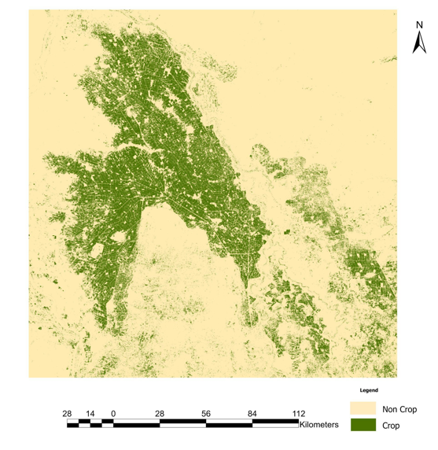
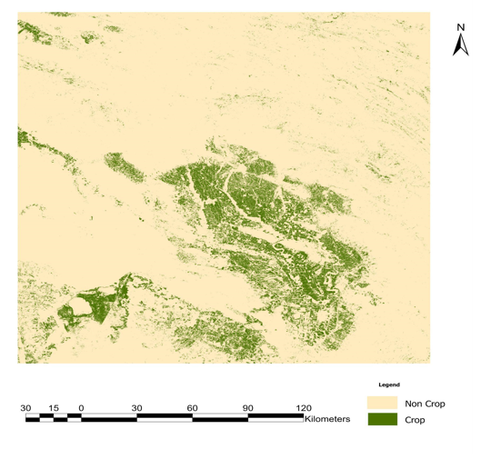
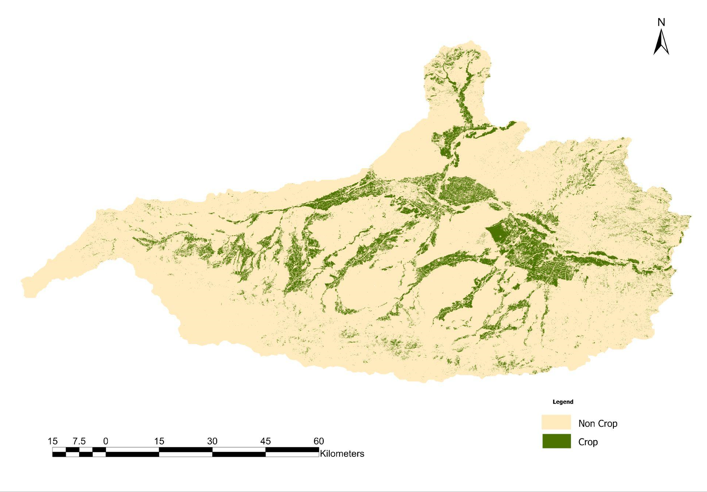

# Zindi Geo-AI CropLand Mapping Competition

- Crop classification was conducted in three distinct regions: Afghanistan, Iran, and Sudan.
- A challenge lies in improving the model to achieve the desired accuracy in model performance, ultimately aiming to generate the Crop Land Extent Map.
- This repository contains Python code, a report, and a dataset, which are useful for understanding the crop classification methodology and its approach.
- Multi-temporal optical Sentinel-2 imagery was used. Various vegetation indices were employed, aiding in the differentiation between Crop and Non-Crop labels.
- Either a Machine Learning or Deep Learning model was utilized and trained on the training dataset. The performance of each regional model was enhanced using Cross Validation, Hyperparameter Optimization Python Libraries, and the Early Stopping technique. To evaluate the model's performance, the best parameter configuration from Grid Search CV (a hyperparameter tuning method) was employed, with the final model selection and its optimal configuration assessed based on the confusion matrix and F1-score.

### Following Folder Contains in Repository:

> 1. **Dataset** Folder Contains Training and Testing Sentinel-2 Vegetation Indices.
> 2. **Notebook** Folder Contains Jupyter Notebook File which explains from data download to data analysis to final model selection and evaluation.
> 3. **saved model** Folder contains final model from Hyperparameter Optimization
> 4. **Submission Folder** conatins the submission csv file of Test Results and Brief explaination documented Report, Presentation PPT, and Predicted Spatial Extent CropLand Map.

### Overall Test Results

| LeaderBoard | Score |
|:----------:|------------:|
| Public    | 0.91111    | 
| Private   | 0.90     | 

### Crop Area Extent Map

- Sudan

- Iran

- Afganistan

